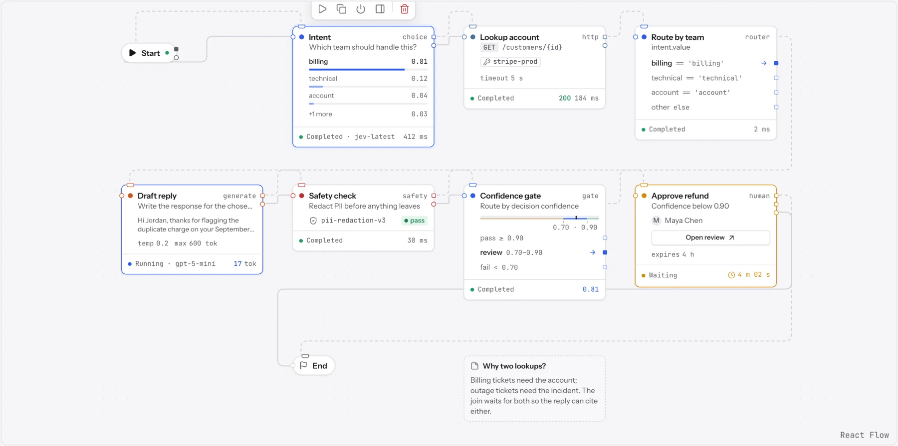
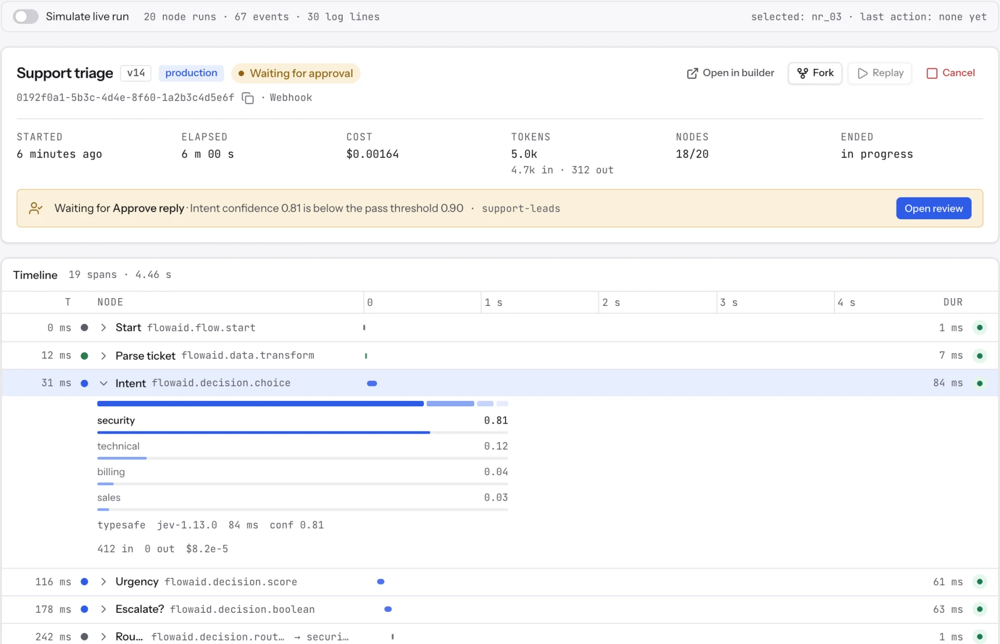
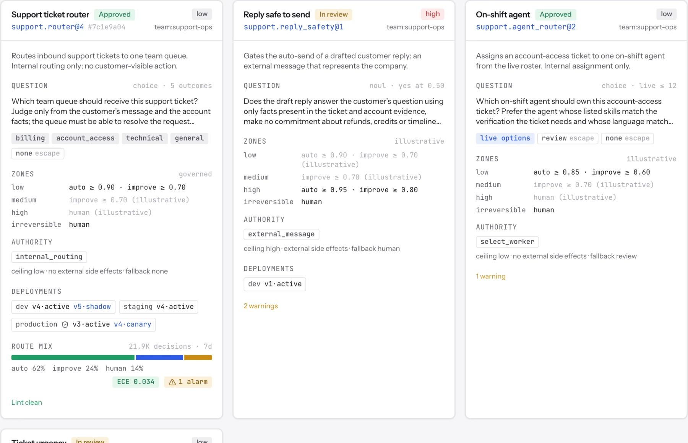
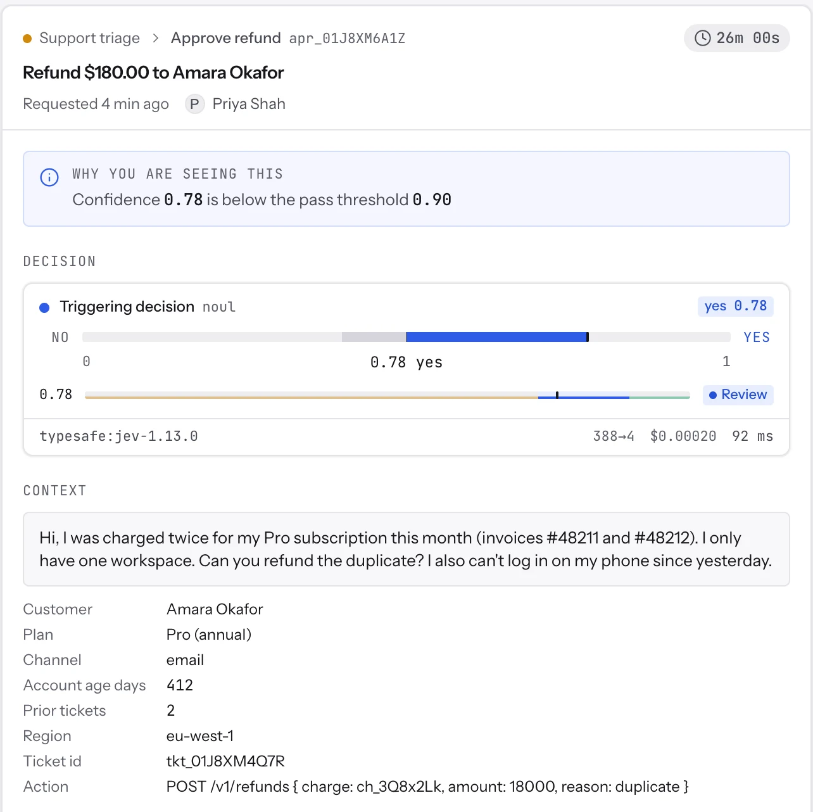
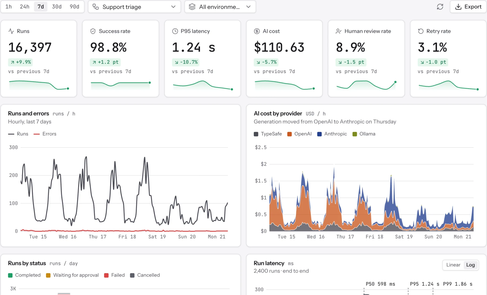

<p align="center">
  <picture>
    <source media="(prefers-color-scheme: dark)" srcset="brand/readme/lockup-dark.svg">
    
  </picture>
</p>

<p align="center">
  <strong>The open-source runtime for AI agents and workflows, with typed decisions you can inspect, verify and trust.</strong>
</p>

<p align="center">
  <a href="https://github.com/MoRohn/flowaid/actions/workflows/ci.yml"></a>
  <a href="LICENSE"></a>
  
  
  
  
</p>

---

FlowAId is a backend-first platform for building, running and evaluating AI agents and
workflows. It treats the **runtime** as the product. Every workflow is a typed document that is
compiled, versioned and executed over an append-only event log. The visual canvas, the REST API,
the TypeScript SDK and the CLI are all clients of that same runtime.

Its central idea is that **decisions are typed data, not prose**. Routing, classification, risk
scoring and approval gates run on [TypeSafe AI's Jev](https://docs.typesafe.ai), a decision model
that returns a constrained answer with a calibrated probability distribution. Confidence then
decides what happens next: act automatically, gather more evidence, or ask a person.

> [!IMPORTANT]
> **FlowAId is pre-alpha.** The architecture is fully designed and the foundation libraries are
> built and tested. The API server, worker and web app are not built yet, so there is nothing
> to deploy today. See [Project status](#project-status).

## Why FlowAId

Most agent frameworks let a generative model make every decision inside a prompt. That is
expensive, hard to audit, and impossible to calibrate. FlowAId separates the jobs:

| Owner              | Does                                                            | In FlowAId                                                            |
| ------------------ | --------------------------------------------------------------- | --------------------------------------------------------------------- |
| **Generative LLM** | Writes: replies, summaries, code, plans                         | Generation nodes (OpenAI, Anthropic, Ollama, any compatible endpoint) |
| **Jev**            | Judges: which option, how severe, yes or no, with probabilities | Decision nodes bound to versioned **decision contracts**              |
| **Code**           | Enforces: permissions, budgets, exact rules, side effects       | Branches, the expression language, policies, human approvals          |

What that makes possible:

- **Confidence drives automation.** Thresholds belong to the consequence of an action, not to
  the model. Irreversible actions always reach a person.
- **Every run can be inspected and replayed.** One event log is the source of truth. Receipts
  record the state, the contract version, the full distribution and the route of every decision.
- **Workflows are checked before they run.** A compiler type-checks every connection, finds
  unreachable nodes and ambiguous branches, and emits an immutable, hashed execution plan.
- **Results are verified, not just reported.** A Lean 4 checker recomputes run and evaluation
  results and returns a certificate or a counterexample (designed; see
  [LEAN_VERIFICATION.md](docs/design/LEAN_VERIFICATION.md)).
- **Nothing is locked in.** Self-hosted on PostgreSQL, every AI provider optional, a flow can be
  downloaded as a runnable code package, and LangChain is supported behind a strict boundary.

## Product tour

These screenshots come from the `@flowaid/ui` component playground
(`pnpm start`), which renders every component against sample data. They
follow your GitHub theme, light or dark.

**Workflow canvas.** Typed ports, decision nodes that show their probability distribution
inline, a confidence gate with its thresholds, and a human approval waiting on its timer.

<picture>
  <source media="(prefers-color-scheme: dark)" srcset="docs/assets/screenshots/canvas-dark.webp">
  
</picture>

**Run trace.** One run's header, cost and token totals, the pending approval, and a timeline
whose decision spans expand into the full distribution returned by Jev.

<picture>
  <source media="(prefers-color-scheme: dark)" srcset="docs/assets/screenshots/run-trace-dark.webp">
  
</picture>

**Decision contracts.** Each contract card shows its question, outcomes and escape hatches,
the confidence zones for each consequence class, what the decision is allowed to do, its
deployments by environment, and how its decisions were routed.

<picture>
  <source media="(prefers-color-scheme: dark)" srcset="docs/assets/screenshots/decision-contracts-dark.webp">
  
</picture>

<table>
  <tr>
    <td width="42%" valign="top">
      <strong>Human review.</strong> A run pauses when confidence falls below its threshold;
      the reviewer sees why, what was decided, and the full context.<br><br>
      <picture>
        <source media="(prefers-color-scheme: dark)" srcset="docs/assets/screenshots/approval-dark.webp">
        
      </picture>
    </td>
    <td width="58%" valign="top">
      <strong>Observability.</strong> Runs, success rate, latency, AI cost by provider and the
      human review rate for a workflow.<br><br>
      <picture>
        <source media="(prefers-color-scheme: dark)" srcset="docs/assets/screenshots/observability-dark.webp">
        
      </picture>
    </td>
  </tr>
</table>

## Project status

| Area                                                 | State                                                                                                                                                                                                   |
| ---------------------------------------------------- | ------------------------------------------------------------------------------------------------------------------------------------------------------------------------------------------------------- |
| Architecture and contracts                           | **Designed.** Architecture, contracts, database, API, UI, code export, LangChain, Jev engineering and Lean verification are all specified in [`docs/design/`](docs/design/)                             |
| `@flowaid/workflow-core`                             | **Built.** Workflow contracts, the FlowExpr expression language, templates and a JSON Schema compatibility checker. 2,665 tests                                                                         |
| `@flowaid/jev`                                       | **Built (library core).** Decision contracts, state packets, bundles, confidence × consequence routing, live menus, receipts, calibration and shadow comparison. 183 tests                              |
| `@flowaid/ui`                                        | **Built (components).** 13 groups of React components: canvas, nodes, trace viewer, inspector, forms, decision visuals, dashboards. 829 tests, with a playground                                        |
| `@flowaid/workflow-compiler`                         | **Built.** Definition → content-hashed execution plan: 8 passes, 94 diagnostics, guard analysis, batching, redaction, diff and migrate. 160 tests                                                       |
| `@flowaid/node-sdk`                                  | **Built.** `defineNode`, `toManifest` (reproduces the fixture manifests exactly), capability-scoped context and a runtime-faithful test harness. 23 tests                                               |
| `@flowaid/providers`                                 | **Built.** Registry, sourced model catalog and pricing, failover with circuit breaking, LLM and rule decision providers, OpenAI-compatible client, record/replay. 80 tests                              |
| `@flowaid/credentials`                               | **Built.** AES-256-GCM envelope with per-credential keys, KEK versions under env/file/KMS/Vault master keys with KCV and rotation, external references, the Redactor and the credential types. 56 tests |
| `@flowaid/shared`, `@flowaid/env`, `@flowaid/config` | **Built.** Primitives, environment schema and tooling presets. 136 tests                                                                                                                                |
| Runtime, database, API, worker, web app              | **Not started.** Planned in [`docs/UPGRADE_PLAN.md`](docs/UPGRADE_PLAN.md), phases P1–P5                                                                                                                |
| CI                                                   | **Running.** GitHub Actions runs the audit, boundary, format, lint, typecheck, build and test gates on every push and pull request                                                                      |

The live snapshot is always [`docs/STATUS.md`](docs/STATUS.md).

## How it works

```
 Canvas · REST API · SDK · CLI · YAML · AI builder
                     │
                     ▼
            WorkflowDefinition ─────── typed JSON document; data flows through bindings,
                     │                  control flows through explicit edges
                     ▼
                 Compiler ───────────── schema, binding, type and guard checks → diagnostics
                     │
                     ▼
              ExecutionPlan ─────────── immutable, content-hashed, versioned
                     │
                     ▼
     Runtime (pure reducer over an append-only event log)
       ├─ Jev decisions     typed answer + distribution → auto / improve / human
       ├─ LLM generation    streamed, budgeted, cost-accounted
       ├─ Tools             HTTP, MCP, OpenAPI, sandboxed code
       └─ Humans            approval, review, form, choice; durable suspension
                     │
                     ▼
   Events · receipts · traces · evaluation · Lean certificates
```

## Quick start

FlowAId is a pnpm monorepo. Today you can run the UI, build and test the libraries, and use
`@flowaid/workflow-core` and `@flowaid/jev` from code. The API server, worker and web app are
not built yet (see [Project status](#project-status)).

### 1. Prerequisites

| Tool    | Version                   | Install                                                                   |
| ------- | ------------------------- | ------------------------------------------------------------------------- |
| Node.js | 24 or newer (`.nvmrc`)    | [nodejs.org](https://nodejs.org) or `nvm install` in the repository       |
| pnpm    | 12.5.1 (`packageManager`) | `corepack enable && corepack prepare pnpm@12.5.1 --activate`              |
| Git     | any recent version        | [git-scm.com](https://git-scm.com)                                        |
| Docker  | optional                  | Only needed for the application stack (`docker compose`) once it is built |

### 2. Start

```sh
git clone https://github.com/MoRohn/flowaid.git
cd flowaid
pnpm start
```

`pnpm start` takes a fresh clone to a running UI in one command. It:

1. **Checks your machine**: Node.js, pnpm, installed dependencies and the port. Anything wrong
   is reported with the exact command that fixes it.
2. **Installs dependencies** when they are missing, or older than `pnpm-lock.yaml` after a
   pull, from the lockfile exactly (`--frozen-lockfile`).
3. **Builds the workspace packages** the UI depends on (cached by Turborepo, so a second start
   is instant).
4. **Serves the UI playground** at <http://127.0.0.1:5178> and stops cleanly on Ctrl+C.

```text
FlowAId · starting the UI playground

[1/4] Preflight
  ✓ Node.js          v25.2.1 (requires >=24.0.0)
  ✓ pnpm             12.5.1
  ✓ Dependencies     installed and in sync with pnpm-lock.yaml
  ✓ Playground port  127.0.0.1:5178 is free
  · Docker           Compose 5.3.0; daemon running

[2/4] Dependencies
✓ already installed

[3/4] Build workspace packages
✓ Workspace packages built (1.4 s)

[4/4] Start the dev server
→ http://127.0.0.1:5178   (Ctrl+C to stop)
```

On a fresh clone pnpm itself installs the dependencies before the script runs; step 2 covers
the case where they are stale, such as after a pull that changed `pnpm-lock.yaml`.

### 3. Options

| Command                          | What it does                                                                |
| -------------------------------- | --------------------------------------------------------------------------- |
| `pnpm start --open`              | Also opens the browser                                                      |
| `pnpm start --port 5200`         | Serves on another port                                                      |
| `pnpm start --host 0.0.0.0`      | Serves on every interface, so other devices on your network can reach it    |
| `pnpm start --prod`              | Builds an optimised bundle and serves that instead of the dev server        |
| `pnpm start --verify`            | Runs every CI gate first (`pnpm check`), then starts                        |
| `pnpm start --skip-install`      | Never installs, even when dependencies are missing or stale                 |
| `pnpm start -- --help`           | Lists the options                                                           |
| `pnpm preflight`                 | Only the machine checks; exits 1 when something must be fixed               |
| `pnpm check`                     | Every CI gate: audit, boundaries, formatting, lint, typecheck, build, tests |
| `pnpm test`                      | Every package's tests                                                       |
| `pnpm --filter @flowaid/ui test` | One package's tests                                                         |

### 4. Troubleshooting

- **`Node.js … is older than the required >=24.0.0`**: run `nvm install` (it reads `.nvmrc`) or
  install Node.js 24 or newer, then open a new terminal.
- **`pnpm … not found` or a major version mismatch**: run
  `corepack enable && corepack prepare pnpm@12.5.1 --activate`.
- **`Playground port … is already in use`**: stop the other process, or run
  `pnpm start --port 5179`.
- **Install refuses a very new package release**: pnpm's minimum release age policy is
  deliberate; the pinned exceptions live in `pnpm-workspace.yaml`.

### Validate a workflow and evaluate an expression

```ts
import { readFileSync } from "node:fs";
import {
  WorkflowDefinitionSchema,
  definitionHash,
  parseExpression,
  evaluateExpression,
  createEvalScope,
  isSubschema,
} from "@flowaid/workflow-core";

const def = WorkflowDefinitionSchema.parse(
  JSON.parse(readFileSync("packages/workflow-core/fixtures/support-triage.json", "utf8")),
);
definitionHash(def); // stable across key order and layout changes

const expr = parseExpression(
  "intent.decision.confidence >= 0.9 && intent.decision.value == 'security'",
);
if (expr.ok) {
  const scope = createEvalScope({
    ports: { intent: { decision: { value: "security", confidence: 0.93 } } },
  });
  evaluateExpression(expr.ast, scope); // true
}

isSubschema({ type: "integer", minimum: 0 }, { type: "number" }); // { ok: true, verified: true }
```

### Route a Jev decision through a decision contract

```ts
import { readFileSync } from "node:fs";
import type { ChoiceDecision } from "@flowaid/workflow-core";
import { parseContract, toDecisionQuestion, toSystemOneQuestion, route } from "@flowaid/jev";

const file = JSON.parse(
  readFileSync("packages/jev/templates/jev-classifier-rollout.contracts.json", "utf8"),
);
const contract = parseContract(file.decisionContracts[0].body); // support.ticket_router@1
const question = toSystemOneQuestion(toDecisionQuestion(contract)); // ready for POST /v1/systemone

const decision: ChoiceDecision = {
  kind: "choice",
  value: "billing",
  confidence: 0.93,
  probabilities: {
    billing: 0.93,
    account_access: 0.03,
    technical: 0.02,
    general: 0.01,
    none: 0.01,
  },
  provider: "typesafe",
  model: "jev-1.13.0",
  latencyMs: 84,
  costUsd: 0.00002,
  attempts: [],
};

route({ contract, decision, calibrated: true });
// → { route: "auto", port: "billing", reasons: ["zone_auto"], consequenceClass: "low", … }
```

Both examples run against the current packages; the decision is written by hand here, and in production it comes from the TypeSafe provider.

## Core concepts

- **Typed decisions.** Jev answers three kinds of question: _Noul_ (yes or no, with P(yes)),
  _Choice_ (one of up to 255 options, with a distribution) and _Score_ (a position on an ordered
  2–10 level rubric). Independent questions about one state go out in one request. The live
  API shape is recorded in [TYPESAFE_API.md](docs/design/TYPESAFE_API.md).
- **Decision contracts.** A decision is a versioned contract (`support.ticket_router@1`) that
  declares its state, outcomes, escape hatches, consequence class, thresholds, allowed actions
  and escalation. Contracts are reviewed like code, run in shadow first, and are rolled out one
  outcome at a time. See the [Jev engineering guides](docs/jev/overview.md).
- **Bindings and control edges.** Data reaches a node only through typed bindings (references,
  templates, expressions). Control flows only along explicit edges. That is what makes a graph
  statically checkable.
- **Event-sourced runs.** The event log is the only source of truth. Replay, recovery,
  restart-from-node, fork and audit all come from it.
- **Human in the loop.** Approval, review, form and choice nodes suspend a run durably, with
  typed requests and responses and external review links.
- **Evaluation.** Datasets of expected decisions, branches and outputs; regression reports that
  can gate publishing; calibration measured per contract version.

## Repository layout

```
brand/                  Identity: logo, design tokens, fonts (OFL), style guide
docker/                 Compose stack and Dockerfile (for the apps, once built)
docs/                   Design, guides, research, plan and status (index: docs/README.md)
packages/
  config/               Shared TypeScript, ESLint and Prettier presets
  shared/               JSON helpers, Result, uuidv7, SHA-256 (browser-safe)
  env/                  Environment variable schema and loader
  workflow-core/        Portable contracts, FlowExpr, templates, schema checker
  workflow-compiler/    Definition → content-hashed execution plan, with diagnostics
  node-sdk/             Write nodes: schemas, manifests, scoped context, test harness
  providers/            Provider registry, pricing catalog, failover, health, LLM client
  credentials/          Envelope encryption, master keys, external secrets, redaction
  jev/                  Jev engineering library and harness templates
  ui/                   React component library and playground
scripts/                Repository checks: boundaries, browser bundle, compose, env, UI inventory
boundaries.json         The allowed dependency graph between packages
```

Planned packages and apps (runtime, database, providers, API, worker, web, SDK, CLI,
code export, LangChain adapters, the FlowAId importer and the Lean checker) are listed with
their responsibilities in [ARCHITECTURE.md §1](docs/design/ARCHITECTURE.md).

## Documentation

|                                                                                     |                                                                          |
| ----------------------------------------------------------------------------------- | ------------------------------------------------------------------------ |
| [Documentation index](docs/README.md)                                               | Every design document, guide and research source                         |
| [Product specification](docs/design/SPEC.md)                                        | What FlowAId is meant to be                                              |
| [Architecture](docs/design/ARCHITECTURE.md)                                         | How it is built, and why                                                 |
| [Jev engineering](docs/jev/overview.md)                                             | Decision contracts, packets, routing, calibration, shadow mode, receipts |
| [Lean verification](docs/design/LEAN_VERIFICATION.md)                               | The self-critical, certified evaluation layer                            |
| [Download code](docs/design/CODE_EXPORT.md) · [LangChain](docs/design/LANGCHAIN.md) | Code export and the LangChain boundary                                   |
| [Upgrade plan](docs/UPGRADE_PLAN.md) · [Status](docs/STATUS.md)                     | What is next, and where things stand                                     |

## Roadmap

1. **Phase 0, finishing:** release automation and git hooks, package builds, contributor docs,
   the UI regression suite.
2. **Phases 1–2:** compiler, database, node SDK, providers (TypeSafe first), credentials,
   observability, then the runtime, core nodes, MCP and OpenAPI tools, and the code sandbox.
3. **Phases 3–4:** API, worker, SDK and CLI, code export, and the LangChain adapters and nodes.
4. **Phase 5:** the web app, and the end-to-end acceptance journey from a clean clone as the
   release gate.
5. **Alongside:** track J (Jev integration across the platform) and track L (the Lean 4 checker
   and certified evaluation).

## Contributing

Contributions are welcome. Start with [CONTRIBUTING.md](CONTRIBUTING.md) and the
[Code of Conduct](CODE_OF_CONDUCT.md). Report security issues privately as described in
[SECURITY.md](SECURITY.md).

## License

Apache License 2.0; see [LICENSE](LICENSE) and [NOTICE](NOTICE). The bundled fonts are under
the SIL Open Font License.
