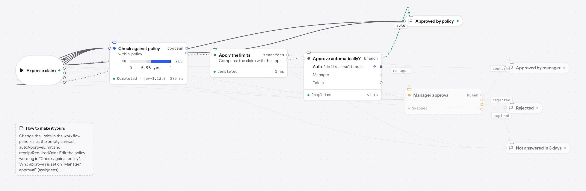
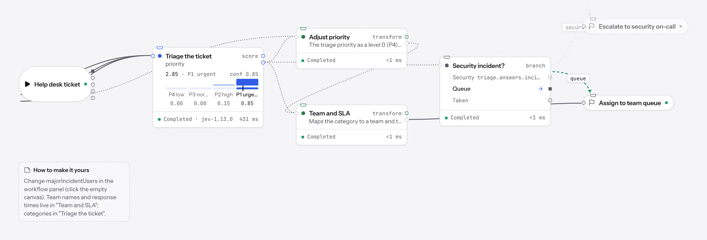
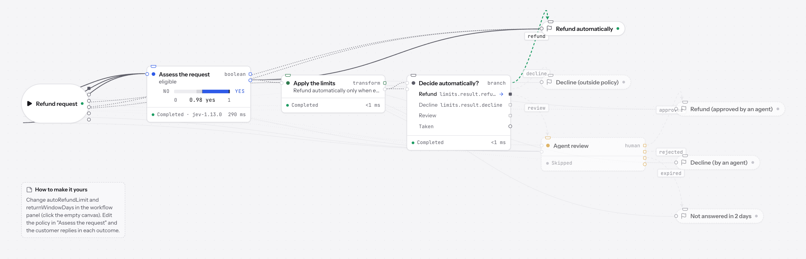

<p align="center">
  <picture>
    <source media="(prefers-color-scheme: dark)" srcset="brand/readme/lockup-dark.svg">
    
  </picture>
</p>

<h3 align="center">Build, run and evaluate AI agents and workflows on your own computer,<br>with typed decisions you can inspect, verify and trust.</h3>

<p align="center">
  <a href="https://github.com/MoRohn/flowaid/actions/workflows/ci.yml"></a>
  <a href="https://github.com/MoRohn/flowaid/actions/workflows/e2e.yml"></a>
  <a href="https://github.com/MoRohn/flowaid/releases"></a>
  <a href="LICENSE"></a>
  
  
  
</p>

<p align="center">
  <a href="#quick-start">Quick start</a> ·
  <a href="#business-flows">Business flows</a> ·
  <a href="#product-tour">Product tour</a> ·
  <a href="#capabilities">Capabilities</a> ·
  <a href="#documentation">Documentation</a>
</p>

---

**FlowAId** is an open-source platform for building, running and evaluating AI agents and
workflows. It runs on your own computer with one command, with no account and no sign-in, and the
same stack deploys to a server with Docker Compose.

Its central idea is that **decisions are typed data, not prose**. Routing, classification, risk
scoring and approval gates run on [TypeSafe AI's Jev](https://docs.typesafe.ai), which returns a
constrained answer with a calibrated probability distribution. Confidence then decides what
happens next: act automatically, gather more evidence, or ask a person. Generative models write;
code enforces the rules.

Every workflow is a typed document that is compiled, versioned and executed over an append-only
event log. The visual builder, REST API, TypeScript SDK, CLI and MCP server are all clients of
that one runtime.

<picture>
  <source media="(prefers-color-scheme: dark)" srcset="docs/assets/screenshots/templates-dark.webp">
  
</picture>

> [!NOTE]
> FlowAId is in public beta; the current release is **0.8.0** (see the [Changelog](CHANGELOG.md)).
> Everything described here runs today, and every change is gated by the unit and PostgreSQL
> suites, an accessibility gallery and a browser acceptance journey against the production builds.
> Interfaces may still change before 1.0.

## Quick start

You need **Node.js 24+**, **pnpm 12** (`corepack enable`), **Docker** (for the database) and
**Git**, on macOS, Windows or Linux.

```sh
git clone https://github.com/MoRohn/flowaid.git && cd flowaid
./flowaid          # Windows: flowaid
```

FlowAId installs what it needs, starts PostgreSQL with pgvector in Docker, builds and starts the
API, worker and web app, and opens **<http://flowaid.localhost:3000>** in its own window, with an
icon in the menu bar or system tray. There is no account to create.

Add a [TypeSafe API key](https://api.typesafe.ai) to `.env.local` to enable decisions:

```sh
echo "TYPESAFE_API_KEY=ts_…" >> .env.local
```

OpenAI, Anthropic or a local Ollama (`OPENAI_API_KEY`, `ANTHROPIC_API_KEY`, `OLLAMA_HOST`) enable
generation; everything else runs without any key. Then:

1. **Pick a business flow** under _Templates_ and choose _Use template_.
2. **Run it** from the builder's Run tab. The Output tab tells you how the run ended, and the
   trace shows every decision's probabilities and cost.
3. **Make it yours**: click the empty canvas to rename it and change its settings, or select a
   step to edit it.
4. **Publish and deploy** a version, then call it from your code, a webhook, a schedule or an MCP
   client.

The Overview's _Get started_ checklist walks you through each step, every page opens with a short
_Start here_ that checks what it needs, and _Guide_ in the top bar explains the page you are on.
Options, the desktop app and troubleshooting are in
[Running FlowAId on your computer](docs/guides/running-locally.md).

## Business flows

Four complete workflows for everyday operations run end to end as soon as you create them, with
only the TypeSafe key: an input form, one TypeSafe call that answers several questions at once,
plain rules, a person when one is needed, and a clear outcome.

| Flow                         | Area             | What it does                                                                                                     | Settings                                  |
| ---------------------------- | ---------------- | ---------------------------------------------------------------------------------------------------------------- | ----------------------------------------- |
| **Expense approval**         | Finance          | Checks a claim against the spending policy; approves small compliant claims, sends the rest to a manager         | `autoApproveLimit`, `receiptRequiredOver` |
| **Sales lead qualification** | Sales            | Scores an inbound lead 0–100 and routes it to sales, nurture, support or discard, with the next step             | `salesScore`                              |
| **IT help desk routing**     | IT operations    | Sets category, priority (P1–P4), team and response time; escalates security incidents to the on-call             | `majorIncidentUsers`                      |
| **Refund request handling**  | Customer service | Checks the refund policy and fraud risk; refunds, declines or sends to an agent, with the reply for the customer | `autoRefundLimit`, `returnWindowDays`     |

What you create is yours: click the empty canvas to rename it and edit its settings (limits,
windows, scores) with validation next to each field, and select any step to change its options,
rules or replies.

Each screenshot below is a real run, captured in the builder: the decision's answer and
probability on the canvas, the branch that was taken in green, and the paths that were not taken
dimmed.

**Expense approval.** A $38.50 taxi claim is within policy, low risk and under the
auto-approve limit, so it is approved without a manager; larger or riskier claims wait for the
_Manager approval_ step.

<picture>
  <source media="(prefers-color-scheme: dark)" srcset="docs/assets/screenshots/flow-expense-approval-dark.webp">
  
</picture>

**IT help desk routing.** A VPN outage affecting 30 people is triaged P1 urgent, the
priority and response time are set, and it is not a security incident, so it goes to the
Network team's queue.

<picture>
  <source media="(prefers-color-scheme: dark)" srcset="docs/assets/screenshots/flow-it-helpdesk-routing-dark.webp">
  
</picture>

**Refund request handling.** A cracked mug is eligible under the refund policy, low risk
and under the refund limit, so it is refunded automatically with the reply to the customer;
other requests are declined by policy or go to _Agent review_.

<picture>
  <source media="(prefers-color-scheme: dark)" srcset="docs/assets/screenshots/flow-refund-requests-dark.webp">
  
</picture>

More templates cover a message triage starter that needs only the TypeSafe key, support triage
with safety checks, GitHub issue triage over MCP (with or without a knowledge base), a LangChain
knowledge assistant, a bounded research agent, and PageIndex document Q&A, comparison and agents.
The [business flows guide](docs/guides/business-flows.md) lists every input, decision and outcome.

## Why FlowAId

Most agent frameworks let a generative model make every decision inside a prompt. That is
expensive, hard to audit and impossible to calibrate. FlowAId separates the jobs:

| Owner              | Does                                                            | In FlowAId                                                                           |
| ------------------ | --------------------------------------------------------------- | ------------------------------------------------------------------------------------ |
| **Generative LLM** | Writes: replies, summaries, code, plans                         | Generation nodes (OpenAI, Anthropic, Google Gemini, Ollama, any compatible endpoint) |
| **Jev**            | Judges: which option, how severe, yes or no, with probabilities | Decision nodes bound to versioned **decision contracts**                             |
| **Code**           | Enforces: permissions, budgets, exact rules, side effects       | Branches, the expression language, policies, human approvals                         |

- **Confidence drives automation.** Thresholds belong to the consequence of an action, not to the
  model. Irreversible actions always reach a person.
- **Every run can be inspected and replayed.** One event log is the source of truth; receipts
  record the state, the contract version, the full distribution and the route of every decision.
- **Workflows are checked before they run.** A compiler type-checks every connection and emits an
  immutable, hashed execution plan; the builder runs the same compiler as you edit.
- **Quality is measured, not assumed.** Evaluation sets score decisions, branches and outputs,
  report calibration, and can gate publishing.
- **Nothing is locked in.** Your data stays in your PostgreSQL, every AI provider is optional, a
  flow downloads as a runnable code package, and workflows are served as MCP tools.

## Product tour

Screenshots of the running application at 2× resolution, following your GitHub theme.

**Every run, inspectable.** The trace viewer has a timeline, the graph, the event log, output,
logs and cost. A decision expands into the full distribution; any run can be replayed, forked onto
another version or restarted from a node.

<picture>
  <source media="(prefers-color-scheme: dark)" srcset="docs/assets/screenshots/run-trace-dark.webp">
  
</picture>

**People in the loop.** Runs pause durably for approvals, reviews, forms and choices. Reviewers see
why they were asked and the run so far, answer with a keystroke, and can hand a single-use link to
someone outside the workspace.

<picture>
  <source media="(prefers-color-scheme: dark)" srcset="docs/assets/screenshots/review-dark.webp">
  
</picture>

<details>
<summary><strong>More screenshots</strong>: the Overview, evaluations, calibration and triggers</summary>

<br>

**Start here.** The Overview guides a new install step by step, then shows runs, success rate,
latency, AI cost, human review rate and what needs attention.

<picture>
  <source media="(prefers-color-scheme: dark)" srcset="docs/assets/screenshots/overview-dark.webp">
  
</picture>

**Quality you can measure.** Evaluation sets built by hand or from real runs: pass rate, branch
correctness, latency, cost, human review rate, calibration per decision and regressions against a
baseline, with a publish gate.

<picture>
  <source media="(prefers-color-scheme: dark)" srcset="docs/assets/screenshots/evaluation-dark.webp">
  
</picture>

<picture>
  <source media="(prefers-color-scheme: dark)" srcset="docs/assets/screenshots/closeup-calibration-dark.webp">
  
</picture>

**Triggers, ready to call.** Webhooks and schedules go live with a deployment. Each webhook shows
its URL, its signature scheme and a request you can paste into a terminal.

<picture>
  <source media="(prefers-color-scheme: dark)" srcset="docs/assets/screenshots/closeup-webhook-dark.webp">
  
</picture>

</details>

## Capabilities

| Area                     | What you get                                                                                                                                                                                                                                                                       |
| ------------------------ | ---------------------------------------------------------------------------------------------------------------------------------------------------------------------------------------------------------------------------------------------------------------------------------- |
| **Build**                | Visual builder with an in-browser compiler, undo/redo and autosave; 63 core nodes plus 9 bundled LangChain nodes; loops, subflows and branches; FlowExpr expressions; an AI workflow builder, an AI critic and a cost optimiser                                                    |
| **Guidance**             | _Start here_ on every page with checks against your workspace; step-by-step creation that ticks off from what you enter, with an _All fields_ view; the Guide, plain-language help with no AI model; Ask FlowAId answers questions about your workspace (with a text model)        |
| **Start fast**           | Business flows for finance, sales, IT and customer service, plus triage, research, retrieval and document templates, each listing what it needs                                                                                                                                    |
| **Decide**               | TypeSafe Jev decisions (yes/no, choice, score) with calibrated distributions, versioned decision contracts, consequence-based thresholds and human failover                                                                                                                        |
| **Generate**             | OpenAI, Anthropic, Google Gemini, Ollama and any OpenAI-compatible endpoint, with routing strategies and failover; Cohere and Jina rerank                                                                                                                                          |
| **Run and observe**      | Event-sourced runs with live traces, replay, restart from a node, fork onto any version and retry a failed node; metrics, Prometheus and OpenTelemetry export, trace reviews and alerts                                                                                            |
| **People**               | Durable approvals, reviews, forms and choices, an inbox with SLAs, single-use external review links                                                                                                                                                                                |
| **Quality**              | Evaluation sets from hand or real runs, scoring of outputs, decisions and branches, calibration, regressions against a baseline, and a publish gate                                                                                                                                |
| **Agents and knowledge** | Bounded agents with built-in calculator, current-time and web-page tools, your MCP and OpenAPI tools, and workflows as tools; active agents appear by name in Add node; knowledge sources with pgvector hybrid search; PageIndex document intelligence with page-checked citations |
| **Integrate**            | REST API and TypeScript SDK, the `flowaid` CLI, workflows served as MCP tools, MCP servers and OpenAPI documents as tools, signed webhooks, schedules, event triggers, installable node plugins                                                                                    |
| **Own it**               | Runs on your computer or your server on PostgreSQL; envelope-encrypted credentials (local key, Vault, Azure Key Vault or GCP KMS); sandboxed code nodes; flows download as runnable TypeScript packages                                                                            |

## Call your workflows

Every workflow deployed to an environment is an HTTP endpoint. Create an API key under
_Settings → API keys_ and limit it to that environment (a key that is not limited must send
`environmentId` with each run):

```sh
curl -X POST http://flowaid.localhost:3001/v1/workflows/<workflow-id>/run \
  -H "Authorization: Bearer fa_live_…" -H "Content-Type: application/json" \
  -d '{"input": {"message": "I was charged twice for order 1182"}, "mode": "sync"}'
```

```ts
import { Flowaid } from "@flowaid/workflow-sdk";

const fa = new Flowaid({
  baseUrl: "http://flowaid.localhost:3001",
  apiKey: process.env.FLOWAID_API_KEY,
});
const run = await fa.workflows.run(workflowId, { message: "Refund please" });
console.log(await run.output());
```

The CLI, MCP tools, webhooks, schedules and events are covered in
[Calling workflows](docs/guides/calling-workflows.md); the packages also work on their own
([Using the libraries](docs/guides/using-the-libraries.md)).

## Deploy

On your own computer, `./flowaid` is all you need. On a server other people reach, use Docker
Compose with password sign-in:

```sh
cp .env.example .env     # set the passwords, FLOWAID_ADMIN_EMAIL and your provider keys
docker compose up -d
```

It answers on http://flowaid.localhost:3000 on that machine (`WEB_PORT` in `.env` changes the
port; compose does not move to a free one). To open it from other devices, set the network
address and URLs in `.env` as
[Open it from other devices](docs/guides/deploying.md#open-it-from-other-devices) shows.
Published release images, TLS, backups and scaling are in
[Deploying FlowAId](docs/guides/deploying.md) and the [operations runbook](docs/operations/RUNBOOK.md).

## How it works

```
 Builder · REST API · SDK · CLI · MCP · webhooks · schedules
                     │
                     ▼
            WorkflowDefinition ─────── typed JSON; data flows through bindings,
                     │                  control flows through explicit edges
                     ▼
                 Compiler ───────────── schema, binding, type and guard checks → diagnostics
                     │                  (the same compiler in the browser, API, worker and CLI)
                     ▼
              ExecutionPlan ─────────── immutable, content-hashed, deployed per environment
                     │
                     ▼
     Runtime (a pure reducer over an append-only event log, in the worker)
       ├─ Jev decisions     typed answer + distribution → auto / improve / human
       ├─ LLM generation    streamed, budgeted, cost-accounted
       ├─ Tools             HTTP, MCP, OpenAPI, sandboxed code, plugins
       ├─ Agents            bounded tool loops; workflows as tools
       ├─ Knowledge         hybrid retrieval over the workspace's sources
       └─ Humans            approval, review, form, choice; durable suspension
                     │
                     ▼
   Events · traces · metrics · alerts · human tasks · evaluations · code export
```

<details>
<summary><strong>Repository layout</strong></summary>

```
apps/
  api/                  Fastify REST API, SSE, webhooks, the MCP server endpoint
  worker/               Orchestrator, node executors, sandbox and plugin hosts, scheduler, jobs
  web/                  Next.js web app: builder, runs, human tasks, evaluations, settings
  docs/                 The documentation site
  pageindex/            The PageIndex document service (Python)
packages/
  workflow-core/        Portable contracts, FlowExpr, templates, schema checker
  workflow-compiler/    Definition → content-hashed execution plan, with diagnostics
  workflow-runtime/     Scheduler, orchestrator, executor, queue drivers
  workflow-sdk/  cli/   TypeScript client · the flowaid command line
  nodes-core/           Built-in nodes and templates (including the business flows)
  node-sdk/             Write nodes: schemas, manifests, scoped context, test harness
  providers/  provider-*/   Provider registry, pricing, failover · TypeSafe, OpenAI, Anthropic, Ollama
  database/             PostgreSQL schema, migrations, RLS, run store, queue
  ui/                   React component library and playground
  nodes-langchain/      The bundled LangChain nodes (LangChain stays in this and packages/langchain)
  …                     advisor, codegen, config, create-flowaid-node, credentials, env, evaluation,
                        importer, insights, jev, knowledge, langchain, mcp, observability,
                        openapi-tools, pageindex, plugins, sandbox, shared, storage
brand/                  Identity: logo, design tokens, fonts, style guide
docker/                 Compose stack and the Dockerfile (api, worker, web targets)
docs/                   Guides, design, operations, project history (index: docs/README.md)
e2e/                    The browser acceptance journey (the release gate)
fixtures/               Test documents and recorded provider responses
scripts/                ./flowaid launcher, preflight, generators and repository checks
boundaries.json         The allowed dependency graph between packages
```

</details>

## Documentation

|                                                                                           |                                                                       |
| ----------------------------------------------------------------------------------------- | --------------------------------------------------------------------- |
| [Documentation index](docs/README.md)                                                     | Every guide, design document and reference                            |
| [Business flows](docs/guides/business-flows.md)                                           | The four operational templates: inputs, decisions, outcomes, settings |
| [Running locally](docs/guides/running-locally.md) · [Deploying](docs/guides/deploying.md) | The desktop app, options and troubleshooting; servers with Compose    |
| [Calling workflows](docs/guides/calling-workflows.md)                                     | REST, SDK, CLI, MCP, webhooks, schedules and events                   |
| [Architecture](docs/design/ARCHITECTURE.md) · [API](docs/design/API.md)                   | How it is built, and the REST, SSE, SDK and CLI surface               |
| [Jev engineering](docs/jev/overview.md)                                                   | Decision contracts, routing, calibration, shadow mode, receipts       |
| [PageIndex](docs/pageindex/SETUP.md) · [LangChain](docs/langchain/overview.md)            | Document intelligence, and the LangChain integration                  |
| [Environment](packages/env/README.md) · [Operations](docs/operations/RUNBOOK.md)          | Every setting; backup, upgrades, the runbook and releasing            |
| [Security](SECURITY.md) · [Threat model](docs/security/THREAT_MODEL.md)                   | Reporting vulnerabilities, and the security model                     |
| [Status](docs/STATUS.md) · [Changelog](CHANGELOG.md)                                      | Where things stand, and what changed in each release                  |

## Roadmap

FlowAId is local-first by design: it runs for one person on their own computer without accounts,
so team identity (single sign-on, invitations, MFA) is deliberately out of scope. Next up: Ask
FlowAId actions with preview and confirmation, Jev calibration in the product, spend forecasting,
Jev decision contracts across the platform, and a Lean 4 checker that certifies run and evaluation
results. The delivery history is in [docs/project/](docs/project/).

## Contributing

Contributions are welcome. Start with [CONTRIBUTING.md](CONTRIBUTING.md) and the
[Code of Conduct](CODE_OF_CONDUCT.md). Report security issues privately as described in
[SECURITY.md](SECURITY.md).

## License

Apache License 2.0; see [LICENSE](LICENSE) and [NOTICE](NOTICE). The bundled fonts are under the
SIL Open Font License.
