<p align="center">
  <picture>
    <source media="(prefers-color-scheme: dark)" srcset="brand/readme/lockup-dark.svg">
    
  </picture>
</p>

<h3 align="center">Build, run and evaluate AI agents and workflows on your own computer,<br>with typed decisions you can inspect, verify and trust.</h3>

<p align="center">
  <a href="https://github.com/MoRohn/flowaid/actions/workflows/ci.yml"></a>
  <a href="https://github.com/MoRohn/flowaid/actions/workflows/e2e.yml"></a>
  <a href="LICENSE"></a>
  
  
  
  
  
</p>

<p align="center">
  <a href="#quick-start">Quick start</a> ·
  <a href="#product-tour">Product tour</a> ·
  <a href="#capabilities">Capabilities</a> ·
  <a href="#deploy">Deploy</a> ·
  <a href="#documentation">Docs</a> ·
  <a href="#roadmap">Roadmap</a>
</p>

---

**FlowAId** is an open-source platform for building, running and evaluating AI agents and
workflows. It runs on your own computer with one command, with no account and no sign-in, and
the same stack deploys to a server with Docker Compose when you want it always on.

It treats the **runtime** as the product. Every workflow is a typed document that is compiled,
versioned and executed over an append-only event log; the visual builder, the REST API, the
TypeScript SDK, the CLI and the MCP server are all clients of that one runtime.

Its central idea is that **decisions are typed data, not prose**. Routing, classification, risk
scoring and approval gates run on [TypeSafe AI's Jev](https://docs.typesafe.ai), a decision model
that returns a constrained answer with a calibrated probability distribution. Confidence then
decides what happens next: act automatically, gather more evidence, or ask a person.

> [!NOTE]
> **FlowAId is in public beta.** Everything described here runs today and every change is gated
> by 5,471 tests, the PostgreSQL suites, an accessibility gallery and a browser acceptance
> journey against the production builds. Interfaces may still change before 1.0; the first
> tagged release (0.4.0, with published container images) is being prepared.

## What's new

- **Local-first.** `pnpm start` opens FlowAId without a sign-in on your own computer; only this
  computer can use that automatic session. Behind public URLs it switches to password sign-in.
- **A guided first run.** The Overview walks you from an empty install to a workflow your code
  can call: connect TypeSafe, create a workflow, run it, answer a human task, publish, call it.
- **Faster everyday work.** ⌘K searches workflows, runs and templates and creates anything;
  lists open on a click; webhooks and schedules are added from the app with a ready-to-paste
  request; failed runs offer _Retry node_; forks can target any published version.
- **Clearer graphs.** Imported and template flows lay out without edges running behind nodes and
  open at a readable zoom.
- **Knowledge, evaluations and credentials that guide you.** Embedding models show whether a key
  is ready, evaluation cases are entered as forms, and each provider key links to where to get
  one and is tested when saved.
- **Releases.** Versioned with changesets; each release publishes multi-arch images with SBOMs
  and provenance to `ghcr.io/morohn/flowaid-{api,worker,web}`.

The full history is in [CHANGELOG.md](CHANGELOG.md); the live snapshot is
[docs/STATUS.md](docs/STATUS.md).

## Why FlowAId

Most agent frameworks let a generative model make every decision inside a prompt. That is
expensive, hard to audit, and impossible to calibrate. FlowAId separates the jobs:

| Owner              | Does                                                            | In FlowAId                                                                           |
| ------------------ | --------------------------------------------------------------- | ------------------------------------------------------------------------------------ |
| **Generative LLM** | Writes: replies, summaries, code, plans                         | Generation nodes (OpenAI, Anthropic, Google Gemini, Ollama, any compatible endpoint) |
| **Jev**            | Judges: which option, how severe, yes or no, with probabilities | Decision nodes bound to versioned **decision contracts**                             |
| **Code**           | Enforces: permissions, budgets, exact rules, side effects       | Branches, the expression language, policies, human approvals                         |

- **Confidence drives automation.** Thresholds belong to the consequence of an action, not to
  the model. Irreversible actions always reach a person.
- **Every run can be inspected and replayed.** One event log is the source of truth: receipts
  record the state, the contract version, the full distribution and the route of every decision.
- **Workflows are checked before they run.** A compiler type-checks every connection, finds
  unreachable nodes and ambiguous branches, and emits an immutable, hashed execution plan; the
  builder runs the same compiler in your browser as you edit.
- **Quality is measured, not assumed.** Evaluation sets score decisions, branches and outputs,
  report calibration, and can gate publishing a new version.
- **Nothing is locked in.** Your data stays in your PostgreSQL, every AI provider is optional, a
  flow downloads as a runnable code package, workflows are served as MCP tools, and external
  flow exports come in through the FlowAId importer.

## Product tour

Screenshots of the running application at 2× resolution, following your GitHub theme. The
workflow is a small refund triage: a TypeSafe decision asks whether a support message wants its
money back, refunds wait for a person, and a signed webhook lets the help desk start runs.

### Start here

The Overview guides a new install step by step, then shows how the workspace's workflows are
running: runs, success rate, latency, AI cost, human review rate and retries.

<picture>
  <source media="(prefers-color-scheme: dark)" srcset="docs/assets/screenshots/overview-dark.webp">
  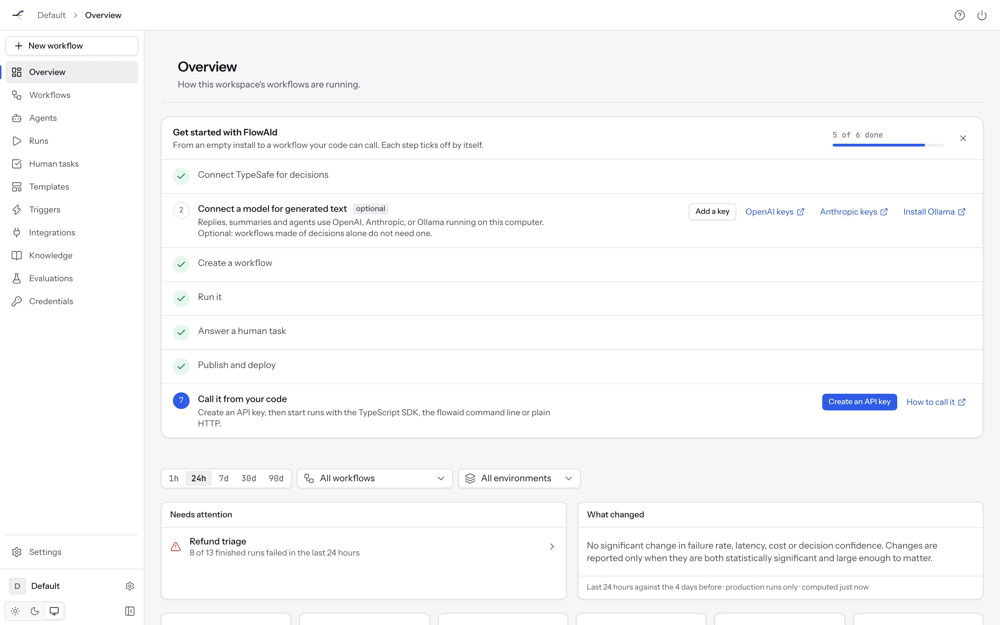
</picture>

### The builder

Nodes, typed ports and control edges on the canvas; the inspector edits a node from its schema;
the draft compiles as you type and runs from the Run tab, with each node's status and a live
trace.

<picture>
  <source media="(prefers-color-scheme: dark)" srcset="docs/assets/screenshots/builder-dark.webp">
  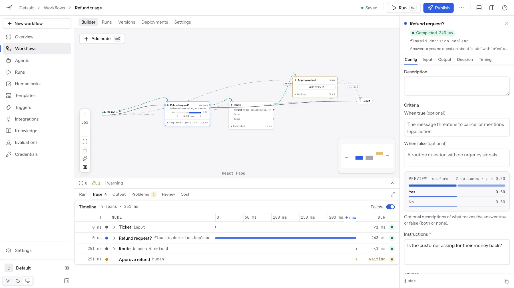
</picture>

<table>
  <tr>
    <td width="58%" valign="top">
      <strong>Decisions you can read.</strong> Every decision node shows its answer, the
      probability behind it, the model and the latency, right on the canvas.<br><br>
      <picture>
        <source media="(prefers-color-scheme: dark)" srcset="docs/assets/screenshots/closeup-decision-node-dark.webp">
        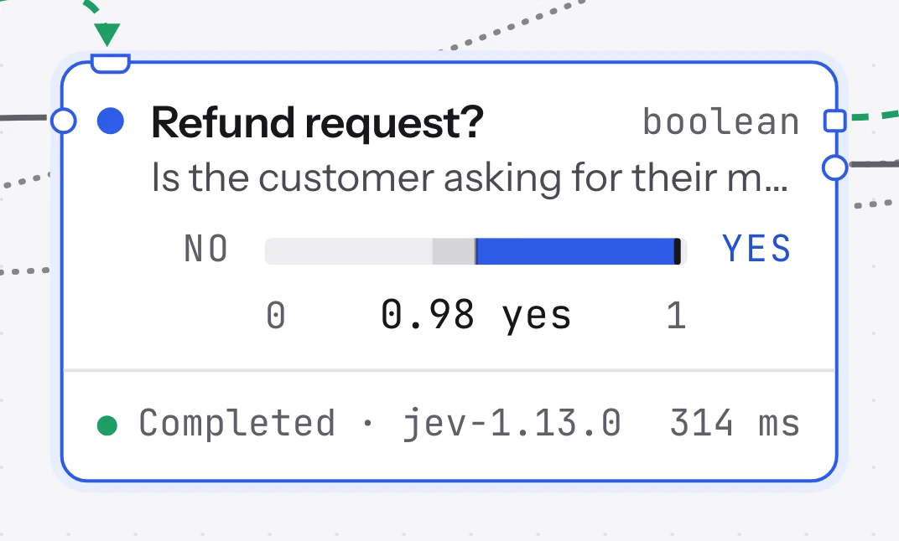
      </picture>
      <br><br><strong>Everything one keystroke away.</strong> ⌘K searches workflows, runs and
      templates, creates anything, and jumps to any page or setting.<br><br>
      <picture>
        <source media="(prefers-color-scheme: dark)" srcset="docs/assets/screenshots/closeup-command-menu-dark.webp">
        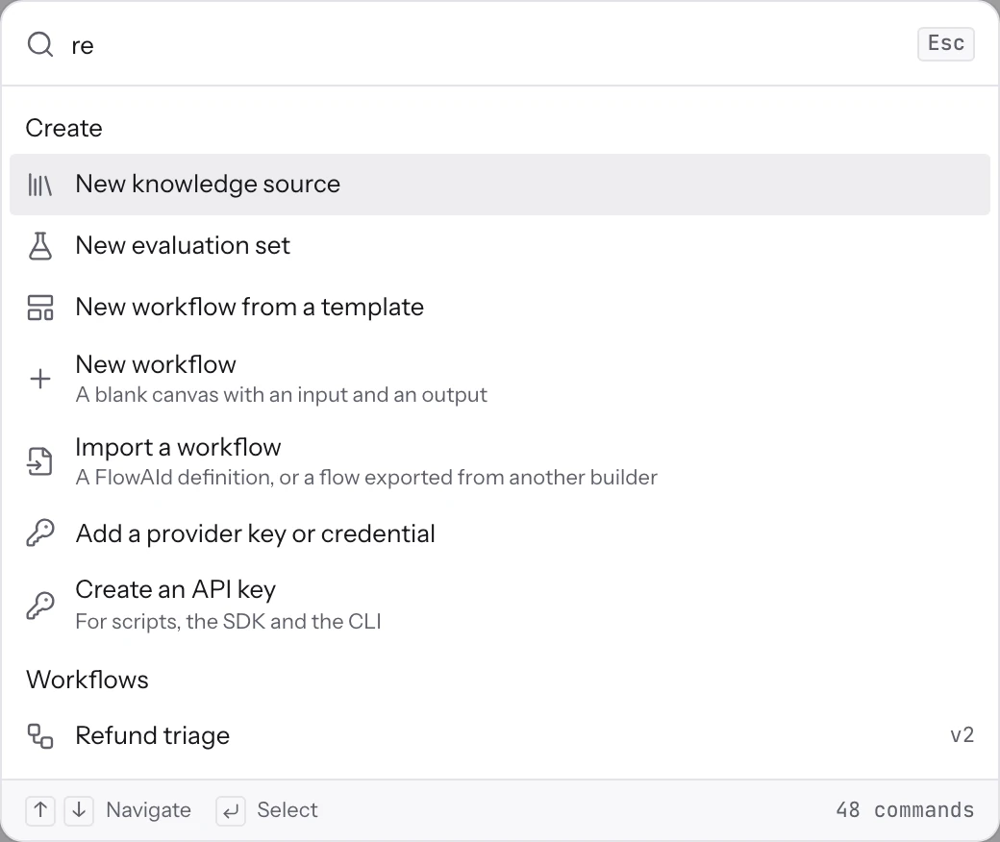
      </picture>
    </td>
    <td width="42%" valign="top">
      <strong>An inspector per node.</strong> Criteria for yes and no with a live preview of the
      prior, instructions, and inputs bound by reference, template or expression.<br><br>
      <picture>
        <source media="(prefers-color-scheme: dark)" srcset="docs/assets/screenshots/closeup-inspector-dark.webp">
        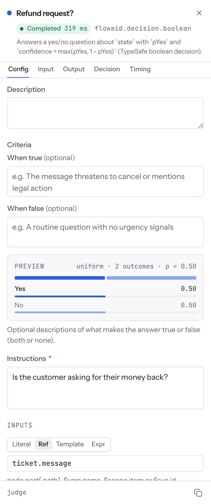
      </picture>
    </td>
  </tr>
</table>

### Every run, inspectable

The trace viewer has a timeline, the graph, the event log, output, logs and cost. A decision
expands into the full distribution TypeSafe returned; any run can be replayed, forked onto
another version or restarted from a node.

<picture>
  <source media="(prefers-color-scheme: dark)" srcset="docs/assets/screenshots/run-trace-dark.webp">
  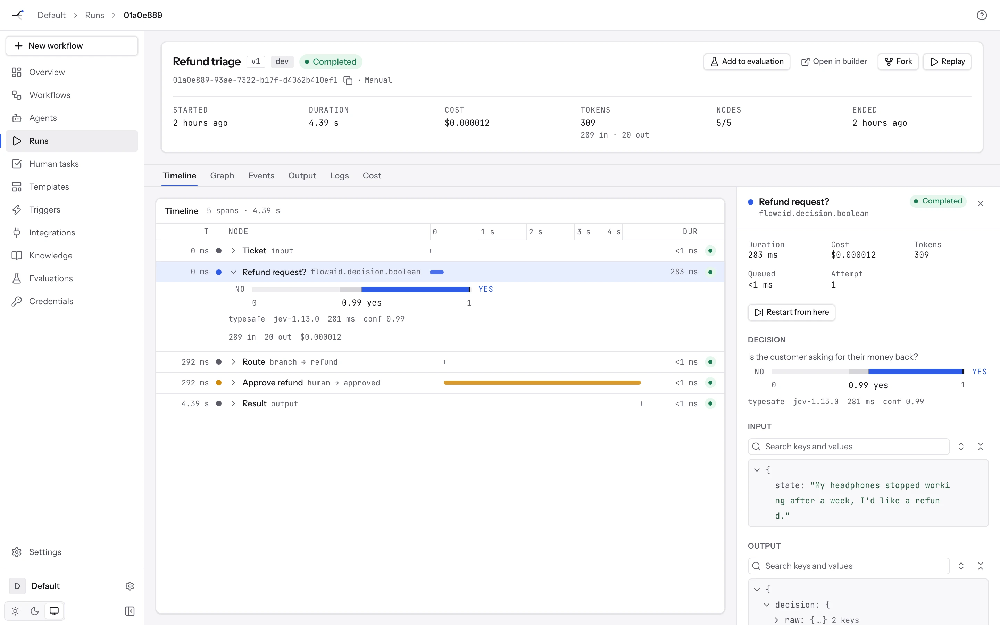
</picture>

<picture>
  <source media="(prefers-color-scheme: dark)" srcset="docs/assets/screenshots/closeup-distribution-dark.webp">
  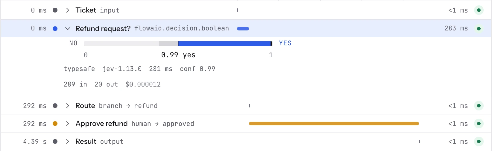
</picture>

### People in the loop

Runs pause durably for approvals, reviews, forms and choices. Reviewers see why they were asked
and the run so far, answer with a keystroke, and can hand a single-use link to someone outside
the workspace.

<table>
  <tr>
    <td width="50%" valign="top">
      <picture>
        <source media="(prefers-color-scheme: dark)" srcset="docs/assets/screenshots/review-dark.webp">
        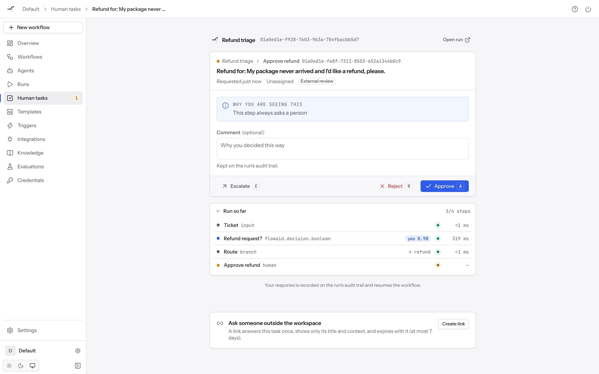
      </picture>
    </td>
    <td width="50%" valign="top">
      <picture>
        <source media="(prefers-color-scheme: dark)" srcset="docs/assets/screenshots/closeup-approval-dark.webp">
        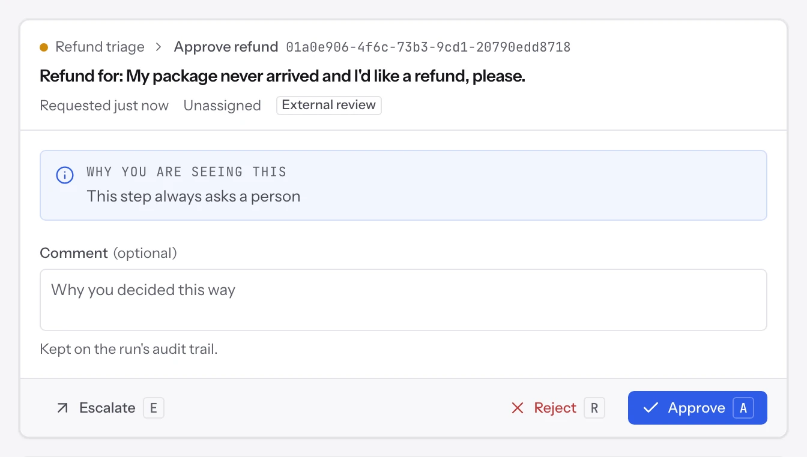
      </picture>
    </td>
  </tr>
</table>

### Quality you can measure

Evaluation sets are built by hand or from real runs and run against any version: pass rate,
branch correctness, latency, cost, human review rate, calibration per decision and regressions
against a baseline, with a publish gate.

<picture>
  <source media="(prefers-color-scheme: dark)" srcset="docs/assets/screenshots/evaluation-dark.webp">
  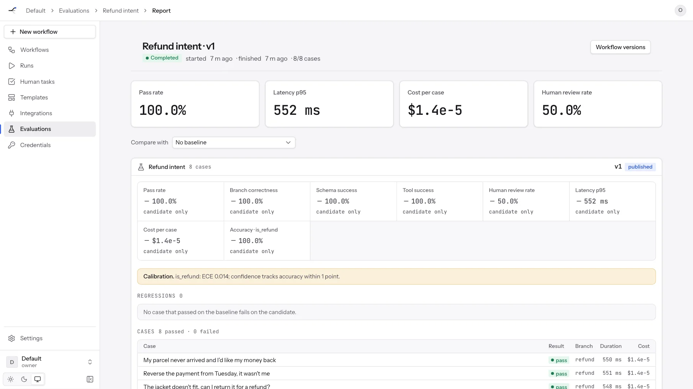
</picture>

<picture>
  <source media="(prefers-color-scheme: dark)" srcset="docs/assets/screenshots/closeup-evaluation-dark.webp">
  
</picture>

<picture>
  <source media="(prefers-color-scheme: dark)" srcset="docs/assets/screenshots/closeup-calibration-dark.webp">
  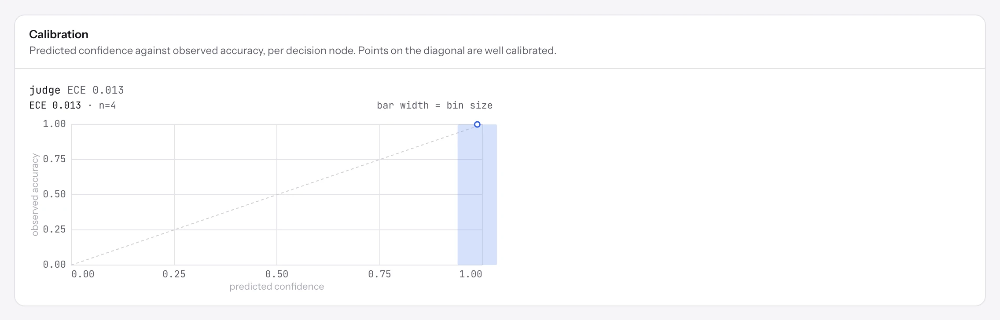
</picture>

### Triggers, ready to call

Webhooks and schedules are added from the app and go live with a deployment. Each webhook shows
its URL, its signature scheme and a request you can paste into a terminal.

<picture>
  <source media="(prefers-color-scheme: dark)" srcset="docs/assets/screenshots/closeup-webhook-dark.webp">
  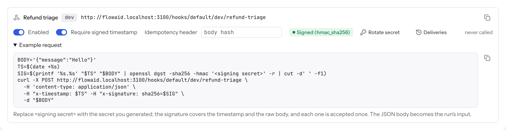
</picture>

### Templates

Tested starting points that compile and run as shipped: GitHub issue triage over MCP (with or
without a knowledge base), support triage with safety checks and a confidence gate, a LangChain
retrieval-augmented assistant, and a bounded research agent.

<picture>
  <source media="(prefers-color-scheme: dark)" srcset="docs/assets/screenshots/templates-dark.webp">
  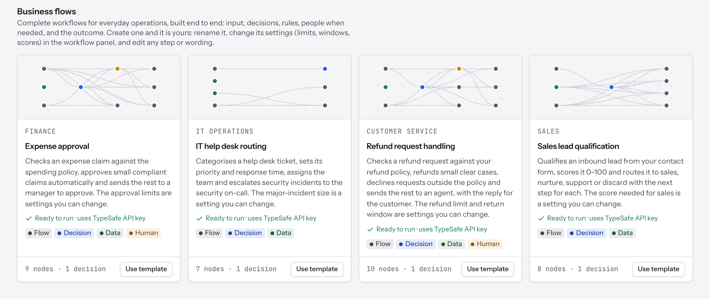
</picture>

## Quick start

### 1. Prerequisites

| Tool    | Version                   | Install                                                                                    |
| ------- | ------------------------- | ------------------------------------------------------------------------------------------ |
| Node.js | 24 or newer (`.nvmrc`)    | [nodejs.org](https://nodejs.org) or `nvm install` in the repository                        |
| pnpm    | 12.5.1 (`packageManager`) | `corepack enable && corepack prepare pnpm@12.5.1 --activate`                               |
| Docker  | any recent version        | Runs the database. Or bring your own PostgreSQL 16 with pgvector and pass `--database-url` |
| Git     | any recent version        | [git-scm.com](https://git-scm.com)                                                         |

A [TypeSafe API key](https://api.typesafe.ai) enables decision nodes; OpenAI, Anthropic or a
local Ollama enable generation. Everything else runs without any key.

### 2. Start FlowAId

```sh
git clone https://github.com/MoRohn/flowaid.git
cd flowaid
echo "TYPESAFE_API_KEY=ts_…" >> .env.local   # optional: enables decision nodes
pnpm start
```

`pnpm start` takes a fresh clone to a running platform in one command. It checks your machine
(Node.js, pnpm, free ports, Docker) and prints the fix for anything missing, installs
dependencies, generates local secrets into `.flowaid/dev.env`, starts PostgreSQL 16 with
pgvector in Docker (or uses `--database-url`), builds what the apps need, and starts the API,
the worker and the web app:

```text
[6/6] Start
✓ API ready on http://flowaid.localhost:3000

→ http://flowaid.localhost:3001   (Ctrl+C to stop)
  opens without a sign-in on this computer
  API http://flowaid.localhost:3000 · docs http://flowaid.localhost:3000/docs
```

Open <http://flowaid.localhost:3001>. Any `*.localhost` name reaches your own computer, so the
address needs no setup (`http://127.0.0.1:3001` works too, and `--domain` picks another name).
There is no account to create: FlowAId signs this computer in by
itself (the API checks for a loopback address, a local host name and a CSRF header on every such
session, so other computers and web pages cannot use it). The API reference (OpenAPI 3.1) is at
<http://flowaid.localhost:3000/docs>.

### 3. Your first workflow

The **Get started** checklist on the Overview walks you through it, and ticks each step off as
you go:

<picture>
  <source media="(prefers-color-scheme: dark)" srcset="docs/assets/screenshots/closeup-checklist-dark.webp">
  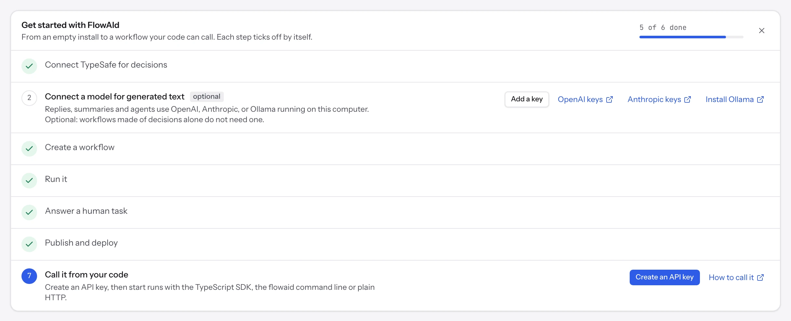
</picture>

1. **Connect TypeSafe.** A `TYPESAFE_API_KEY` in `.env.local` is picked up as a server key, or
   add it under _Credentials → New credential_ (encrypted, and tested when saved).
2. **Create a workflow.** _New workflow_ offers a blank canvas, a template, or an import (a
   FlowAId definition or a flow exported from another visual builder).
3. **Run it.** Fill in the input in the builder's Run tab and press **Run draft**; nodes light up
   as they run, and a finished run switches to its output.
4. **Answer a human task.** Waiting runs appear under _Human tasks_ with the decision that sent
   them there.
5. **Publish and deploy.** **Publish** shows what changed and any warnings, and can deploy to
   `dev`, `staging` or `prod`, optionally gated on an evaluation.
6. **Call it from your code.** Create an API key under _Settings → API keys_; the dialog shows a
   ready-to-paste request.

### 4. Call it from anywhere

Create an API key under _Settings → API keys_ (pin it to an environment), then:

```sh
curl -X POST http://flowaid.localhost:3000/v1/workflows/<workflow-id>/run \
  -H "Authorization: Bearer fa_live_…" -H "Content-Type: application/json" \
  -d '{"input": {"message": "I was charged twice for order 1182"}, "mode": "sync"}'
```

A run that finishes answers `200` with its output, cost and usage; one that waits for a person
answers `202` with the human task. From TypeScript, with `@flowaid/workflow-sdk`:

```ts
import { Flowaid } from "@flowaid/workflow-sdk";

const fa = new Flowaid({
  baseUrl: "http://flowaid.localhost:3000",
  apiKey: process.env.FLOWAID_API_KEY,
});
const run = await fa.workflows.run(workflowId, { message: "Refund please" });
for await (const event of run.stream()) {
  if (event.type === "DECISION_COMPLETED") console.log(event.decision.confidence);
}
console.log(await run.output());
```

From a terminal, with the `flowaid` CLI (`packages/cli`; every API operation is a command, and
`pnpm flowaid` runs it from a checkout):

```sh
pnpm flowaid login --api-url http://flowaid.localhost:3000 --api-key fa_live_…
pnpm flowaid workflow run <workflow-id> --input '{"message":"Refund please"}' --watch
pnpm flowaid workflow package <workflow-id> --version 1 --out refund-triage.zip   # runnable code
pnpm flowaid validate ./my-flow.json                                               # no server
```

**As MCP tools.** Under _Integrations → Workflows as MCP tools_, expose a workflow and mint an
MCP token; any MCP client can then list and call it at `http://flowaid.localhost:3000/mcp/<workspace>`
(streamable HTTP, `Authorization: Bearer <token>`).

**From webhooks, schedules and events.** Triggers in a workflow's definition become live URLs,
cron schedules and event subscriptions when a version is deployed to an environment.

### 5. Options

| Command                                    | What it does                                                                         |
| ------------------------------------------ | ------------------------------------------------------------------------------------ |
| `pnpm start --open`                        | Also opens the browser                                                               |
| `pnpm start --port 3101 --api-port 3100`   | Serves the web app and the API on other ports                                        |
| `pnpm start --database-url postgres://…`   | Uses your PostgreSQL 16 (with pgvector) instead of the Docker container              |
| `pnpm start --prod`                        | Runs the production builds (Next's standalone server, compiled API and worker)       |
| `pnpm start --domain my.flowaid.localhost` | Opens the app under another name (any `*.localhost` name reaches this computer)      |
| `pnpm start --host 0.0.0.0`                | Listens on every interface (put a TLS proxy in front before exposing it)             |
| `pnpm start --verify`                      | Runs every CI gate first (`pnpm check`), then starts                                 |
| `pnpm start --playground`                  | Serves the `@flowaid/ui` component playground instead                                |
| `pnpm start -- --help`                     | Lists every option                                                                   |
| `pnpm preflight`                           | Only the machine checks                                                              |
| `pnpm check`                               | Every CI gate: audit, boundaries, generated files, format, lint, types, build, tests |
| `pnpm test:acceptance`                     | The browser acceptance journey against a running stack                               |

### 6. Troubleshooting

- **`Node.js … is older than the required >=24.0.0`**: run `nvm install` (it reads `.nvmrc`),
  then open a new terminal.
- **`Web port …` or `API port … is already in use`**: stop the other process, or pass `--port`
  and `--api-port`.
- **`no DATABASE_URL and the Docker daemon is not running`**: start Docker Desktop, or pass
  `--database-url`.
- **`secret TYPESAFE_API_KEY is not bound in this environment`** when running: bind the
  workflow's secret to a credential in the workflow's _Settings → Secrets_.
- **`refused to connect to 127.0.0.1: private or reserved address`** (or `FORBIDDEN` from a
  database query node): workflows may not reach this computer or your network by default. To
  call your own local services, add `FLOWAID_ALLOW_PRIVATE_NETWORK=true` to `.env` and restart
  (see [SECURITY.md](SECURITY.md#private-network-access) for the trade-off).
- **A reset**: stop FlowAId, then `docker rm -f flowaid-dev-db && docker volume rm flowaid-dev-db`
  and delete `.flowaid/` (this deletes every workflow, run and credential).

## Capabilities

| Area                     | What you get                                                                                                                                                                                                                  |
| ------------------------ | ----------------------------------------------------------------------------------------------------------------------------------------------------------------------------------------------------------------------------- |
| **Build**                | Visual builder with an in-browser compiler, undo/redo and autosave; 60 core nodes plus bundled LangChain nodes; loops, subflows and branches; FlowExpr expressions; an AI workflow builder, an AI critic and a cost optimiser |
| **Decide**               | TypeSafe Jev decisions (yes/no, choice, score) with calibrated distributions, versioned decision contracts, consequence-based thresholds and human failover                                                                   |
| **Generate**             | OpenAI, Anthropic, Google Gemini, Ollama and any OpenAI-compatible endpoint, with candidate models, routing strategies (cheapest, fastest, healthiest) and failover; Cohere and Jina rerank                                   |
| **Run and observe**      | Event-sourced runs with live traces, replay, restart from a node, fork onto any version and retry a failed node; metrics, Prometheus and OpenTelemetry export, trace reviews and alerts to email, Slack or webhooks           |
| **People**               | Durable approvals, reviews, forms and choices, an inbox with SLAs, single-use external review links                                                                                                                           |
| **Quality**              | Evaluation sets built by hand or from real runs, scoring of outputs, decisions and branches, calibration, regressions against a baseline, and a publish gate                                                                  |
| **Agents and knowledge** | A bounded agent node with tools and workflows as tools; knowledge sources from uploads, pages, sitemaps or repositories with pgvector vector, keyword and hybrid search                                                       |
| **Integrate**            | REST API and TypeScript SDK, the `flowaid` CLI, workflows served as MCP tools, MCP servers and OpenAPI documents as tools, webhooks with signatures, schedules, event triggers, installable node plugins                      |
| **Own it**               | Runs on your computer or your server on PostgreSQL; credentials under envelope encryption (local key, Vault, Azure Key Vault or GCP KMS); sandboxed code nodes; a flow downloads as a runnable TypeScript package             |

## Deploy

**On your own computer**, `pnpm start` is all you need (above). **On a server other people
reach**, use Docker Compose: the same images the release gate tests, with password sign-in.

| `FLOWAID_AUTH_MODE` | Who it is for                                                                                                                                 |
| ------------------- | --------------------------------------------------------------------------------------------------------------------------------------------- |
| `auto` (default)    | `local` when the app's URLs are loopback, `password` otherwise                                                                                |
| `local`             | One person on this computer; no sign-in, sessions only for callers on this machine                                                            |
| `password`          | A server: email and password sign-in for the owner (the compose stack sets it); the first boot prints a generated password unless you set one |

```sh
cp .env.example .env
for v in POSTGRES_PASSWORD POSTGRES_CODE_PASSWORD; do
  sed -i.bak "s/^$v=$/$v=$(openssl rand -hex 16)/" .env
done
# set FLOWAID_ADMIN_EMAIL / FLOWAID_ADMIN_PASSWORD and your provider keys in .env
docker compose up -d
```

To run a published release instead of building from source, set `FLOWAID_IMAGE_TAG` and add
the images overlay: `docker compose -f docker/compose.yml -f docker/compose.images.yml up -d`
([docs/RELEASING.md](docs/RELEASING.md)).

The stack runs PostgreSQL 16 with pgvector, the API, the worker, a separate `worker-code` sandbox
host for code nodes and the web app; queues and the event bus run over PostgreSQL. Before you put
it on a network:

- **Terminate TLS in front** of the web app and the API, set `FLOWAID_BASE_URL`,
  `FLOWAID_WEB_URL` and `CORS_ORIGINS`, and tell the API which proxies to trust
  (`FLOWAID_TRUST_PROXY`).
- **Back up the `flowaid-data` and `postgres-data` volumes.** The master key decrypts every
  stored credential; without it they are lost.
- **Scale out** with `docker compose --profile scale up -d` (Redis and worker replicas), and keep
  artifacts in any S3-compatible store with `S3_*` (or `--profile s3` for a bundled one).

Every variable is documented in [`packages/env/README.md`](packages/env/README.md); services,
networks and secret scoping in [`docker/README.md`](docker/README.md).

## Project status

| Gate                     | Where                                                                                             |
| ------------------------ | ------------------------------------------------------------------------------------------------- |
| Audit, boundaries, types | `pnpm check` and CI `check`: dependency audit, the package boundary graph, generated files, lint  |
| 5,471 tests              | CI `test` and `integration` (PostgreSQL with pgvector, Redis, isolated-vm)                        |
| Accessibility            | CI `ui gallery`: axe (WCAG 2.x A and AA) and console checks over every component, both themes     |
| Acceptance journey       | E2E against the production builds with recorded provider replay and secret-canary log checks      |
| Releases                 | Changesets, multi-arch images with SBOMs and provenance, Dependabot for patches and minor updates |

Phases 0 to 6 of the [upgrade plan](docs/UPGRADE_PLAN.md) are complete; see
[docs/STATUS.md](docs/STATUS.md) for the per-package snapshot and the known gaps.

## Architecture

```
 Builder · REST API · SDK · CLI · MCP · webhooks · schedules
                     │
                     ▼
            WorkflowDefinition ─────── typed JSON document; data flows through bindings,
                     │                  control flows through explicit edges
                     ▼
                 Compiler ───────────── schema, binding, type and guard checks → diagnostics
                     │                  (the same compiler in the browser, API, worker, CLI)
                     ▼
              ExecutionPlan ─────────── immutable, content-hashed, versioned, deployed per
                     │                  environment
                     ▼
     Runtime (pure reducer over an append-only event log, in the worker)
       ├─ Jev decisions     typed answer + distribution → auto / improve / human
       ├─ LLM generation    streamed, budgeted, cost-accounted
       ├─ Tools             HTTP, MCP, OpenAPI, sandboxed code, plugins
       ├─ Agents            bounded tool loops; workflows as tools
       ├─ Knowledge         hybrid retrieval over the workspace's sources
       └─ Humans            approval, review, form, choice; durable suspension
                     │
                     ▼
   Events · traces · metrics · alerts · human tasks · evaluations · code export
```

### Core concepts

- **Typed decisions.** Jev answers three kinds of question: _Noul_ (yes or no, with P(yes)),
  _Choice_ (one of up to 255 options, with a distribution) and _Score_ (a position on an ordered
  2–10 level rubric). Independent questions about one state go out in one request. The live
  API shape is recorded in [TYPESAFE_API.md](docs/design/TYPESAFE_API.md).
- **Decision contracts.** A decision is a versioned contract (`support.ticket_router@1`) that
  declares its state, outcomes, escape hatches, consequence class, thresholds, allowed actions
  and escalation. See the [Jev engineering guides](docs/jev/overview.md).
- **Bindings and control edges.** Data reaches a node only through typed bindings (references,
  templates, expressions). Control flows only along explicit edges. That is what makes a graph
  statically checkable.
- **Event-sourced runs.** The event log is the only source of truth. Replay, recovery, audit
  and the trace viewer all come from it.
- **Versions and environments.** Drafts autosave; publishing creates an immutable version;
  deployments pin a version per environment, with its own secret bindings and triggers.
- **Human in the loop.** Approval, review, form and choice nodes suspend a run durably, with
  typed requests and responses, an inbox, and single-use external review links.
- **Evaluation.** Datasets of expected decisions, branches and outputs; reports with
  calibration and regressions that can gate publishing.
- **Run actions.** Replay a run from its log, restart it on the same input, fork it onto another
  version from a chosen node, or retry one failed node in place.
- **Triggers.** Schedules, webhooks with signature checks, events correlated to waiting runs, and
  workflows exposed as MCP tools; failures and rejections reach your notification channels.

### Use the libraries directly

The packages work on their own. Validate a workflow and evaluate an expression:

```ts
import { readFileSync } from "node:fs";
import {
  WorkflowDefinitionSchema,
  definitionHash,
  parseExpression,
  evaluateExpression,
  createEvalScope,
  isSubschema,
} from "@flowaid/workflow-core";

const def = WorkflowDefinitionSchema.parse(
  JSON.parse(readFileSync("packages/workflow-core/fixtures/support-triage.json", "utf8")),
);
definitionHash(def); // stable across key order and layout changes

const expr = parseExpression(
  "intent.decision.confidence >= 0.9 && intent.decision.value == 'security'",
);
if (expr.ok) {
  const scope = createEvalScope({
    ports: { intent: { decision: { value: "security", confidence: 0.93 } } },
  });
  evaluateExpression(expr.ast, scope); // true
}

isSubschema({ type: "integer", minimum: 0 }, { type: "number" }); // { ok: true, verified: true }
```

Route a Jev decision through a decision contract:

```ts
import { readFileSync } from "node:fs";
import type { ChoiceDecision } from "@flowaid/workflow-core";
import { parseContract, toDecisionQuestion, toSystemOneQuestion, route } from "@flowaid/jev";

const file = JSON.parse(
  readFileSync("packages/jev/templates/jev-classifier-rollout.contracts.json", "utf8"),
);
const contract = parseContract(file.decisionContracts[0].body); // support.ticket_router@1
const question = toSystemOneQuestion(toDecisionQuestion(contract)); // ready for POST /v1/systemone

const decision: ChoiceDecision = {
  kind: "choice",
  value: "billing",
  confidence: 0.93,
  probabilities: {
    billing: 0.93,
    account_access: 0.03,
    technical: 0.02,
    general: 0.01,
    none: 0.01,
  },
  provider: "typesafe",
  model: "jev-1.13.0",
  latencyMs: 84,
  costUsd: 0.00002,
  attempts: [],
};

route({ contract, decision, calibrated: true });
// → { route: "auto", port: "billing", reasons: ["zone_auto"], consequenceClass: "low", … }
```

### Repository layout

```
apps/
  api/                  Fastify REST API, SSE, webhooks, the MCP server endpoint
  worker/               Orchestrator, node executors, sandbox and plugin hosts, scheduler, jobs
  web/                  Next.js web app: builder, runs, human tasks, evaluations, settings
  docs/                 The documentation site
brand/                  Identity: logo, design tokens, fonts (OFL), style guide
docker/                 Compose stack and the one Dockerfile (api, worker, web targets)
docs/                   Design, guides, research, plan and status (index: docs/README.md)
e2e/                    The browser acceptance journey (the release gate)
packages/
  config/               Shared TypeScript, ESLint and Prettier presets
  shared/  env/         JSON helpers, Result, uuidv7 · environment schema and loader
  workflow-core/        Portable contracts, FlowExpr, templates, schema checker
  workflow-compiler/    Definition → content-hashed execution plan, with diagnostics
  workflow-runtime/     Scheduler, orchestrator, executor, runLocally, queue drivers
  workflow-sdk/  cli/   TypeScript client and builders · the flowaid command line
  node-sdk/             Write nodes: schemas, manifests, scoped context, test harness
  nodes-core/           Built-in nodes and templates
  providers/            Provider registry, pricing catalog, failover, health, LLM client
  provider-typesafe/    TypeSafe Jev decisions (System One)
  provider-openai/  provider-anthropic/  provider-ollama/
  mcp/  openapi-tools/  MCP client and exposure · OpenAPI tools
  sandbox/              isolated-vm and container executors for code and shell nodes
  storage/              Artifact storage: local volume or S3
  credentials/          Envelope encryption, master keys, external secrets, redaction
  database/             PostgreSQL schema, migrations, RLS, run store, queue, repositories
  evaluation/  jev/     Evaluation runner and reports · Jev decision-contract library
  codegen/              Download code: flows as runnable TypeScript packages
  advisor/              Cost optimiser, AI workflow builder and AI critic
  knowledge/            Knowledge sources, ingestion, hybrid pgvector search
  importer/             The FlowAId importer for external flow exports
  plugins/  create-flowaid-node/   Plugin registry, install and host · node package scaffold
  langchain/  nodes-langchain/   LangChain adapters · bundled LangChain nodes
  observability/        Redacting logger, tracing, metrics, alerts, run timelines
  ui/                   React component library and playground
scripts/                pnpm start, preflight, generators and repository checks
boundaries.json         The allowed dependency graph between packages
```

## Documentation

|                                                                                     |                                                                          |
| ----------------------------------------------------------------------------------- | ------------------------------------------------------------------------ |
| [Documentation index](docs/README.md)                                               | Every design document, guide and research source                         |
| [Product specification](docs/design/SPEC.md)                                        | What FlowAId is meant to be                                              |
| [Architecture](docs/design/ARCHITECTURE.md) · [API](docs/design/API.md)             | How it is built, and the REST, SSE, SDK and CLI surface                  |
| [Jev engineering](docs/jev/overview.md)                                             | Decision contracts, packets, routing, calibration, shadow mode, receipts |
| [Download code](docs/design/CODE_EXPORT.md) · [LangChain](docs/design/LANGCHAIN.md) | Code export and the LangChain boundary                                   |
| [Importing](apps/docs/content/importing.md)                                         | Bringing external flow exports into FlowAId                              |
| [Environment](packages/env/README.md) · [Docker](docker/README.md)                  | Every setting, and the production stack                                  |
| [Upgrade plan](docs/UPGRADE_PLAN.md) · [Status](docs/STATUS.md)                     | What is next, and where things stand                                     |
| [Changelog](CHANGELOG.md) · [Releasing](docs/RELEASING.md)                          | Release notes, versions and published images                             |

## Roadmap

FlowAId is local-first by design: it runs for one person on their own computer without accounts,
so team identity (single sign-on, invitations, MFA) is deliberately not planned. Next:

1. **0.4.0**, the first tagged release, with its published images.
2. **Track J:** Jev decision contracts across the platform.
3. **Track L:** a Lean 4 checker that certifies run and evaluation results (see
   [LEAN_VERIFICATION.md](docs/design/LEAN_VERIFICATION.md)).

## Contributing

Contributions are welcome. Start with [CONTRIBUTING.md](CONTRIBUTING.md) and the
[Code of Conduct](CODE_OF_CONDUCT.md). Report security issues privately as described in
[SECURITY.md](SECURITY.md).

## License

Apache License 2.0; see [LICENSE](LICENSE) and [NOTICE](NOTICE). The bundled fonts are under
the SIL Open Font License.
