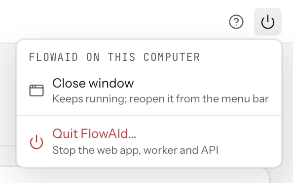
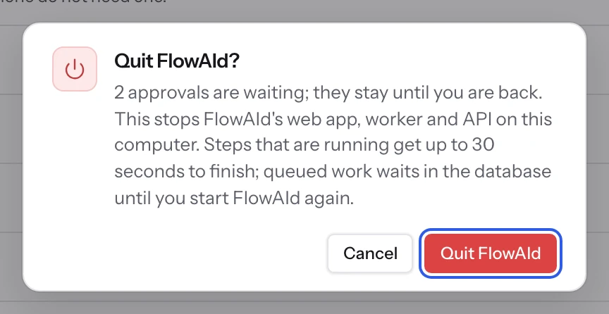

# Running FlowAId on your computer

FlowAId runs for one person on their own computer with one command: no account, no sign-in, and
nothing left running when you quit. This guide covers what `./flowaid` does, its options, and
what to do when something goes wrong.

## Prerequisites

| Tool    | Version                   | Install                                                                                    |
| ------- | ------------------------- | ------------------------------------------------------------------------------------------ |
| Node.js | 24 or newer (`.nvmrc`)    | [nodejs.org](https://nodejs.org) or `nvm install` in the repository                        |
| pnpm    | 12.5.1 (`packageManager`) | `corepack enable && corepack prepare pnpm@12.5.1 --activate`                               |
| Docker  | any recent version        | Runs the database. Or bring your own PostgreSQL 16 with pgvector and pass `--database-url` |
| Git     | any recent version        | [git-scm.com](https://git-scm.com)                                                         |

The same on macOS and Windows (Docker Desktop on both); Linux works too.

A [TypeSafe API key](https://api.typesafe.ai) enables decision nodes; OpenAI, Anthropic or a
local Ollama enable generation. Everything else runs without any key.

## Start FlowAId

```sh
git clone https://github.com/MoRohn/flowaid.git && cd flowaid
./flowaid        # macOS and Linux
```

On Windows, in Command Prompt or PowerShell (where the last line is `.\flowaid`):

```bat
git clone https://github.com/MoRohn/flowaid.git
cd flowaid
flowaid
```

FlowAId opens in its own window at **<http://flowaid.localhost:3000>**, and its icon appears in
the menu bar on macOS and in the notification area (the system tray) on Windows. There is no
account to create: on your own computer FlowAId signs you in by itself.

That is the whole setup. `./flowaid` (`flowaid.cmd` on Windows) checks Node.js and pnpm, and hands over to `pnpm start`
(the same command, if you prefer it). It installs dependencies, generates local secrets into
`.flowaid/dev.env`, and starts PostgreSQL 16 with pgvector in Docker. Then it builds and starts
the API, the worker and the web app:

```text
✓ API ready on http://flowaid.localhost:3001

→ http://flowaid.localhost:3000   (Quit FlowAId in the app, or Ctrl+C)
  opens without a sign-in on this computer
✓ FlowAId is in the menu bar: reopen the window or quit from its icon
✓ opened FlowAId in its own window
```

<picture>
  <source media="(prefers-color-scheme: dark)" srcset="../assets/screenshots/closeup-desktop-menu-dark.webp">
  
</picture>
<picture>
  <source media="(prefers-color-scheme: dark)" srcset="../assets/screenshots/closeup-quit-dialog-dark.webp">
  
</picture>

- **Closing and quitting.** The power button at the top right of the app has **Close window**
  (FlowAId keeps running in the background; reopen it from its icon) and **Quit FlowAId** (stops
  the web app, worker and API, after asking). Both are also in the command menu (⌘K / Ctrl+K).
- **The icon.** Its menu has **Open FlowAId** and **Quit FlowAId**, and shows what runs in the
  background: runs in progress and approvals waiting. A new approval brings a notification, and
  the macOS icon shows how many are waiting. Quitting from the icon while runs are in progress
  asks first. On Windows the icon needs nothing extra; on macOS it is built once, in a few
  seconds, with the Xcode command line tools (`xcode-select --install` if they are missing).
  On Linux it needs `yad`.
- **The window.** With Chrome, Edge, Brave or Chromium installed, FlowAId gets an app window of
  its own (a separate profile in `.flowaid/window`). Otherwise it opens in your default browser.
  A browser tab can't always be closed by the page; FlowAId then tells you to close it yourself.
- **Nothing left running.** Quit, Ctrl+C, closing the terminal, or even the launcher crashing all
  stop every process FlowAId started. Running `./flowaid` again while it runs opens its window
  instead of starting a second copy, and a start after a hard crash ends anything left over.

- **Keys (optional).** Put provider keys in `.env.local`: `TYPESAFE_API_KEY=ts_…` for decision
  nodes, and `OPENAI_API_KEY`, `ANTHROPIC_API_KEY` or `OLLAMA_HOST` for generation.
- **PDF documents.** `./flowaid --pageindex` also runs the PageIndex service, which needs
  Python 3.10+ (see [docs/pageindex/SETUP.md](../pageindex/SETUP.md)).
- **The address.** Any `*.localhost` name reaches your own computer, so it needs no setup;
  `http://127.0.0.1:3000` works too. The API is on port 3001, and its reference is at
  <http://flowaid.localhost:3001/docs>.
- **A busy port.** If another app already uses 3000, FlowAId moves to the next free port and
  prints the address.

## Options

| Command                                   | What it does                                                                         |
| ----------------------------------------- | ------------------------------------------------------------------------------------ |
| `./flowaid --no-open`                     | Doesn't open FlowAId's window (open the address yourself)                            |
| `./flowaid --no-tray`                     | Doesn't show the menu bar (tray) icon                                                |
| `./flowaid --pageindex`                   | Also runs the PageIndex service for PDF documents (Python 3.10+)                     |
| `./flowaid --port 3100 --api-port 3101`   | Serves the web app and the API on these ports (and stops if either is taken)         |
| `./flowaid --database-url postgres://…`   | Uses your PostgreSQL 16 (with pgvector) instead of the Docker container              |
| `./flowaid --prod`                        | Runs the production builds (Next's standalone server, compiled API and worker)       |
| `./flowaid --domain my.flowaid.localhost` | Opens the app under another name (any `*.localhost` name reaches this computer)      |
| `./flowaid --host 0.0.0.0`                | Listens on every interface (put a TLS proxy in front before exposing it)             |
| `./flowaid --verify`                      | Runs every CI gate first (`pnpm check`), then starts                                 |
| `./flowaid --playground`                  | Serves the `@flowaid/ui` component playground instead                                |
| `./flowaid --help`                        | Lists every option                                                                   |
| `pnpm preflight`                          | Only the machine checks                                                              |
| `pnpm check`                              | Every CI gate: audit, boundaries, generated files, format, lint, types, build, tests |
| `pnpm smoke:desktop`                      | Starts, quits and kills FlowAId to check it never leaves a process running           |
| `pnpm test:acceptance`                    | The browser acceptance journey against a running stack                               |

## Troubleshooting

- **`Node.js … is older than the required >=24.0.0`**: run `nvm install` (it reads `.nvmrc`),
  then open a new terminal.
- **`Web port …` or `API port … is already in use`**: a port you passed with `--port` or
  `--api-port` is taken; stop the other app or pass another port. (Busy default ports are not an
  error: `pnpm start` moves to the next free one.)
- **`no DATABASE_URL and the Docker daemon is not running`**: start Docker Desktop, or pass
  `--database-url`.
- **`secret TYPESAFE_API_KEY is not bound in this environment`** when running: bind the
  workflow's secret to a credential in the workflow's _Settings → Secrets_.
- **`refused to connect to 127.0.0.1: private or reserved address`** (or `FORBIDDEN` from a
  database query node): workflows may not reach this computer or your network by default. To
  call your own local services, add `FLOWAID_ALLOW_PRIVATE_NETWORK=true` to `.env` and restart
  (see [SECURITY.md](../../SECURITY.md#private-network-access) for the trade-off).
- **A reset**: stop FlowAId, then `docker rm -f flowaid-dev-db && docker volume rm flowaid-dev-db`
  and delete `.flowaid/` (this deletes every workflow, run and credential).
